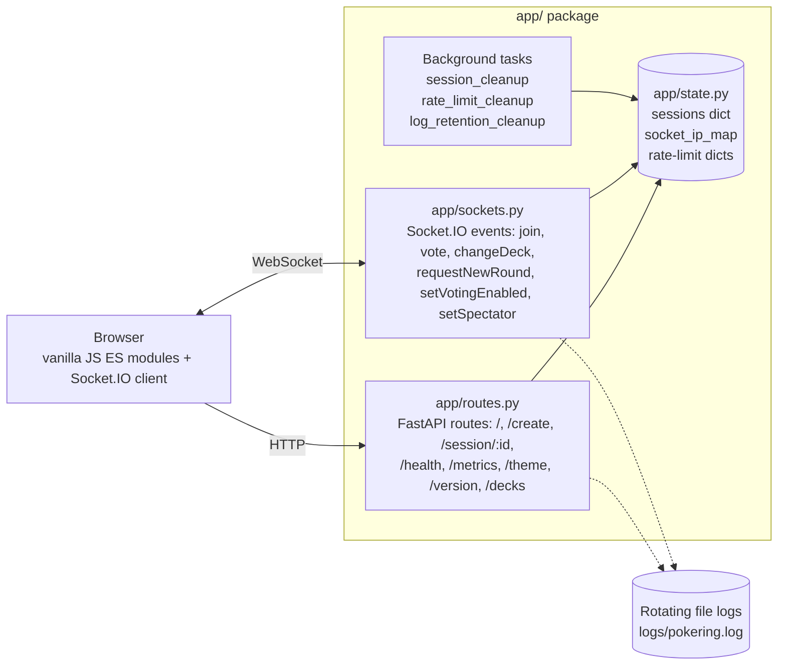

# Pokering Points


Real-time planning poker estimation app. No accounts, no database — create a session, share the link, vote.

Built with FastAPI + Socket.IO backend and vanilla JavaScript frontend.

<!-- Screenshot — add once available

-->

## Architecture



No database. No build step. Single process. State is lost on restart — sessions expire idle/absolute (see [Session Limits](#session-limits)).

## Quick Start

```bash
python3 -m venv venv
source venv/bin/activate
pip install -r requirements.txt
python3 server.py
```

App starts at **http://localhost:8000**.

## How It Works

1. Open the app and click **Start a Poker Session**
2. Share the session link with your team
3. Everyone picks an estimate from the card deck
4. Votes auto-reveal with a 3-second countdown when everyone has voted
5. See average, median, and outlier highlights
6. Host clicks **Start New Round** to re-vote (same session, no redirect)

### Roles

- **Host** (first to join): controls rounds, deck type, voting lock, and participation toggle
- **Participants**: join via shared link, pick cards, see results

### Deck Types

| Deck      | Values                    |
| --------- | ------------------------- |
| Fibonacci | 1, 2, 3, 5, 8, 13, 21, ?  |
| Hours     | 1, 2, 4, 8, 16, 24, 40, ? |
| T-Shirt   | XS, S, M, L, XL, XXL, ?   |

Host can switch decks before any votes are cast.

## Environment Variables

All optional. Defaults work out of the box for local development.

| Variable                 | Default            | Description                                                                                                               |
| ------------------------ | ------------------ | ------------------------------------------------------------------------------------------------------------------------- |
| `SERVER_HOST`            | `0.0.0.0`          | Bind address                                                                                                              |
| `SERVER_PORT`            | `8000`             | Port                                                                                                                      |
| `ENVIRONMENT`            | `development`      | Set `production` to disable auto-reload                                                                                   |
| `CORS_ORIGINS`           | `*`                | Comma-separated allowed origins                                                                                           |
| `TRUST_PROXY`            | `false`            | Enable `X-Forwarded-For` IP parsing (set `true` behind nginx/Caddy)                                                       |
| `PROXY_DEPTH`            | `1`                | Number of reverse proxies in front; picks Nth-from-right hop of `X-Forwarded-For`. Only effective when `TRUST_PROXY=true` |
| `LOG_DIR`                | `logs`             | Directory for audit log files                                                                                             |
| `LOG_MAX_BYTES`          | `5242880`          | Max size per log file (bytes, default 5MB)                                                                                |
| `LOG_BACKUP_COUNT`       | `3`                | Number of rotated log files to keep                                                                                       |
| `LOG_RETENTION_DAYS`     | `30`               | Delete rotated log files older than N days. `0` disables                                                                  |
| `RATE_LIMIT_WHITELIST`   | _(empty)_          | Comma-separated IPs/CIDRs to bypass all rate limits (e.g., `192.168.1.0/24,10.0.0.1`)                                     |
| `MAX_RATE_LIMIT_ENTRIES` | `10000`            | Cap on tracked IPs/sockets for rate limiting; oldest evicted when exceeded                                                |
| `THEME_TZ`               | `Europe/Amsterdam` | Timezone for date-based theme schedule (IANA tz name)                                                                     |

No API keys or database credentials needed.

## Production Deployment

```bash
ENVIRONMENT=production TRUST_PROXY=true python3 server.py
```

When running behind a reverse proxy (nginx, Caddy, Traefik):

- Set `TRUST_PROXY=true` so rate limiting uses the real client IP
- Set `PROXY_DEPTH` to the number of proxies between the client and the app (default `1` = single proxy). With two proxies (e.g., CDN → nginx → app), set `PROXY_DEPTH=2`
- Proxy WebSocket connections to the same port (Socket.IO needs both HTTP and WS)
- HSTS headers are automatically added when served over HTTPS

### CORS

Production **rejects** `CORS_ORIGINS=*` combined with credentials — set an explicit origin list:

```bash
CORS_ORIGINS="https://poker.example.com,https://admin.example.com"
```

In development, `*` is accepted but credentials are auto-disabled (browsers reject the combo).

## Monitoring

| Endpoint       | Description                                           |
| -------------- | ----------------------------------------------------- |
| `GET /health`  | JSON — uptime, active sessions, rate limit stats      |
| `GET /metrics` | Prometheus text format — sessions, users, rate limits |
| `GET /version` | Current version + last 2 changelogs                   |

## Themes

Date-activated themes defined in `config/themes.json`:

| Theme      | Active      | Visual                                   |
| ---------- | ----------- | ---------------------------------------- |
| Default    | Year-round  | Blue tones                               |
| Christmas  | Dec 1 - 31  | Green/red, snowflakes, Santa hat on logo |
| Koningsdag | Apr 23 - 30 | Orange/blue, crown on logo, Dutch flags  |

Add custom themes by editing `themes.json` — no code changes needed.

## Session Limits

| Limit                    | Value     |
| ------------------------ | --------- |
| Max active sessions      | 1,000     |
| Max users per session    | 100       |
| Session idle timeout     | 2 hours   |
| Session absolute timeout | 24 hours  |
| Session cleanup interval | 5 minutes |

## Rate Limits

| Action         | Limit              |
| -------------- | ------------------ |
| Create session | 3s cooldown per IP |
| Join session   | 5s cooldown per IP |
| Vote           | 30/min per socket  |
| Change deck    | 20/min per socket  |
| New round      | 30/hour per socket |

## Tech Stack

- **Python 3.13** (supports 3.10+)
- **FastAPI** + **Uvicorn** — ASGI server
- **python-socketio** — real-time WebSocket layer
- **Vanilla JS** frontend — no build step, no npm
- **In-memory** sessions — no database required

## Security

- CSP headers, `script-src 'self'` only (no CDN, no `unsafe-inline`). Socket.IO client vendored at `public/javascript/vendor/socket.io.min.js`
- `connect-src` auto-narrows in production (no `localhost` origins)
- X-Frame-Options DENY, X-Content-Type-Options nosniff, Referrer-Policy strict-origin-when-cross-origin
- HSTS when served over HTTPS
- Crypto-secure session IDs (16-char URL-safe tokens from `secrets.token_urlsafe`)
- `/create` requires POST (prevents drive-by prefetch state change)
- Client IP is server-derived in Socket.IO handlers — never trusted from client payload
- `X-Forwarded-For` parsing honors `PROXY_DEPTH` (last-hop by default)
- Input validation via regex on all user inputs; usernames allow unicode letters/digits/spaces with control chars stripped
- Rate-limit tracking dicts bounded (`MAX_RATE_LIMIT_ENTRIES`) — oldest entries evicted to prevent IPv6 flood growth
- Rate limiting on all Socket.IO events and HTTP endpoints

### Audit logs & PII

- Logs include IPs (for rate-limit forensics) and user-chosen usernames. No email/tokens logged
- Rotated files deleted after `LOG_RETENTION_DAYS` (default 30). Adjust for your compliance needs
- For GDPR/privacy: document retention in your hosting terms; reduce `LOG_RETENTION_DAYS` if required
