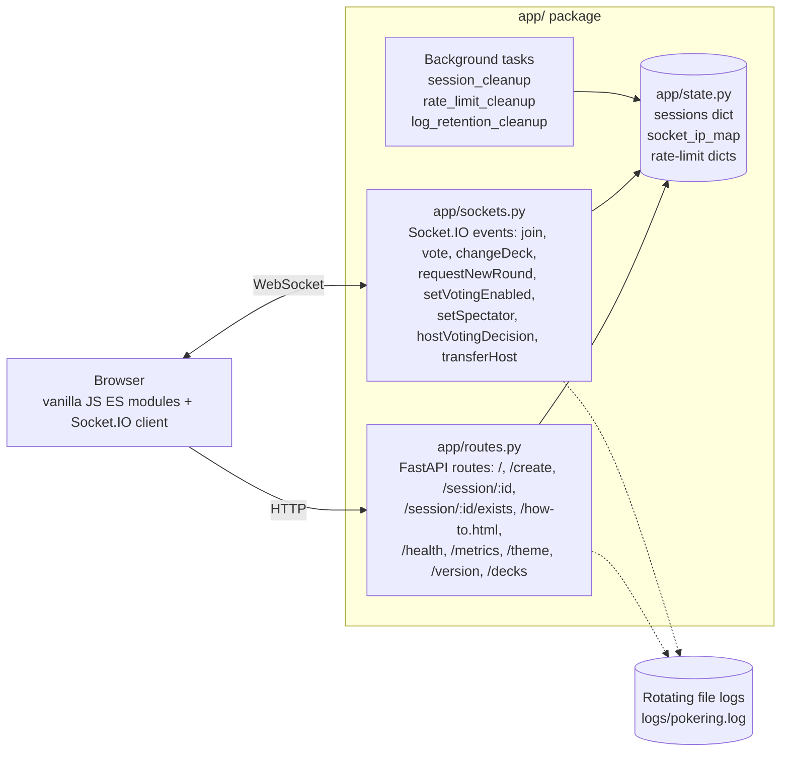

# Pokering Points


Real-time planning poker estimation app. No accounts, no database — create a session, share the link, vote.

Built with FastAPI + Socket.IO backend and vanilla JavaScript frontend.

The app includes an in-app **How-to** page at `/how-to.html` with workflows, examples, controls,
and icon explanations for users.

<!-- Screenshot — add once available

-->

## Architecture



No database. No build step. Single process. State is lost on restart — sessions expire idle/absolute (see [Session Limits](#session-limits)).

## Quick Start

```bash
python3 -m venv venv
source venv/bin/activate
pip install -r requirements.txt
python3 server.py
```

App starts at **http://localhost:8000**.

## Development Checks

Install the Python lint/format tools into your active virtual environment:

```bash
pip install -r requirements-dev.txt
```

Run the project checks before shipping changes:

```bash
npm run lint
npm run format
npm run audit:deps
python3 -m ruff check .
python3 -m black --check .
python3 -m pytest
python3 -m pip_audit -r requirements.txt
python3 -m compileall app server.py version.py
```

Jenkins runs the same checks before deployment, including the pytest suite,
Python dependency auditing with `pip-audit -r requirements.txt` and
frontend/tooling dependency auditing with `npm audit --audit-level=high`.

### Tests

`tests/` covers the Socket.IO handlers (join/vote/reveal flow, reconnect
preservation, host transfer, reconnect-token rejection), the HTTP endpoints
(`/create` CSRF + rate limiting, `/maintenance` with malformed config files,
`/health`/`/metrics` auth), and the pure validation/scheduling helpers.
Handlers are invoked directly with `sio.emit` recorded — no real websocket
transport. Both CI pipelines (GitHub Actions and Jenkins) gate on `pytest`.

## How It Works

1. Open the app and click **Start a Poker Session**
2. Share the session link with your team
3. Everyone picks an estimate from the card deck
4. Votes auto-reveal with a 3-second countdown when everyone has voted
5. See average, median, and outlier highlights
6. Host clicks **Start New Round** to re-vote (same session, no redirect)
7. Use **How-to** for a user-facing guide to controls, icons, and example workflows

### Roles

- **Host** (first to join): controls rounds, deck type, voting lock, participation toggle, and host transfer
- **Participants**: join via shared link, pick cards, see results
- **Spectators**: watch without being counted as required voters

If the host disconnects and does not return within the reconnect grace period, the oldest active
non-spectator participant is promoted automatically. The host can also manually transfer control to
an active voter from the user list.

Brief disconnects within the reconnect grace period preserve the user's role, spectator setting,
vote, and one-change state.

### Deck Types

| Deck      | Values                    |
| --------- | ------------------------- |
| Fibonacci | 1, 2, 3, 5, 8, 13, 21, ?  |
| Hours     | 1, 2, 4, 8, 16, 24, 40, ? |
| T-Shirt   | XS, S, M, L, XL, XXL, ?   |

Host can switch decks before any votes are cast.

## Environment Variables

Defaults work out of the box for local development. In production two variables are mandatory:
`CORS_ORIGINS` (explicit origins) and `METRICS_TOKEN` — the app refuses to start without them.

| Variable                     | Default                    | Description                                                                                                                                                                          |
| ---------------------------- | -------------------------- | ------------------------------------------------------------------------------------------------------------------------------------------------------------------------------------ |
| `SERVER_HOST`                | `0.0.0.0`                  | Bind address                                                                                                                                                                         |
| `SERVER_PORT`                | `8000`                     | Port                                                                                                                                                                                 |
| `ENVIRONMENT`                | `development`              | Set `production` to disable auto-reload                                                                                                                                              |
| `CORS_ORIGINS`               | `*`                        | Comma-separated allowed origins                                                                                                                                                      |
| `TRUST_PROXY`                | `false`                    | Enable `X-Forwarded-For` IP parsing (set `true` behind nginx/Caddy)                                                                                                                  |
| `PROXY_DEPTH`                | `1`                        | Number of reverse proxies in front; picks Nth-from-right hop of `X-Forwarded-For`. Only effective when `TRUST_PROXY=true`                                                            |
| `LOG_DIR`                    | `logs`                     | Directory for audit log files                                                                                                                                                        |
| `LOG_MAX_BYTES`              | `5242880`                  | Max size per log file (bytes, default 5MB)                                                                                                                                           |
| `LOG_BACKUP_COUNT`           | `3`                        | Number of rotated log files to keep                                                                                                                                                  |
| `LOG_RETENTION_DAYS`         | `30`                       | Delete rotated log files older than N days. `0` disables                                                                                                                             |
| `RATE_LIMIT_WHITELIST`       | _(empty)_                  | Comma-separated IPs/CIDRs to bypass all rate limits (e.g., `192.168.1.0/24,10.0.0.1`)                                                                                                |
| `MAX_RATE_LIMIT_ENTRIES`     | `10000`                    | Cap on tracked IPs/sockets for rate limiting; oldest evicted when exceeded                                                                                                           |
| `THEME_TZ`                   | `Europe/Amsterdam`         | Timezone for date-based theme schedule (IANA tz name)                                                                                                                                |
| `MAINTENANCE_ENABLED`        | `false`                    | Show a scheduled restart/deploy banner when enabled                                                                                                                                  |
| `MAINTENANCE_AT`             | _(empty)_                  | Scheduled restart/deploy time in `HH:MM`, interpreted in `MAINTENANCE_TZ`                                                                                                            |
| `MAINTENANCE_TZ`             | `THEME_TZ`                 | IANA timezone for maintenance banner scheduling                                                                                                                                      |
| `MAINTENANCE_MESSAGE`        | `Restart/deploy scheduled` | Banner message prefix                                                                                                                                                                |
| `MAINTENANCE_FILE`           | `config/maintenance.json`  | Optional live JSON override for maintenance banner state; read by `/maintenance` on every request, no restart needed                                                                 |
| `TRUSTED_PROXY_IPS`          | _(empty)_                  | Comma-separated IPs/CIDRs of trusted reverse proxies. Only honoured when `TRUST_PROXY=true`. Empty = trust all peers (backward compat; logs a prominent security warning at startup) |
| `METRICS_TOKEN`              | _(empty)_                  | Bearer token for `/health` and `/metrics`. Empty keeps them open in development; **production refuses to start without it**                                                          |
| `LOG_FORMAT`                 | `text`                     | Log format: `text` (human-readable) or `json` (one-line JSON per record)                                                                                                             |
| `COUNTDOWN_SECONDS`          | `3`                        | Auto-reveal countdown duration in seconds                                                                                                                                            |
| `HTTP_RATE_LIMIT_PER_MINUTE` | `300`                      | Global per-IP limit across all HTTP endpoints (except `/healthz`). `0` disables                                                                                                      |

No API keys or database credentials needed.

## Production Deployment

```bash
ENVIRONMENT=production TRUST_PROXY=true python3 server.py
```

When running behind a reverse proxy (nginx, Caddy, Traefik):

- Set `TRUST_PROXY=true` so rate limiting uses the real client IP
- Set `PROXY_DEPTH` to the number of proxies between the client and the app (default `1` = single proxy). With two proxies (e.g., CDN → nginx → app), set `PROXY_DEPTH=2`
- Proxy WebSocket connections to the same port (Socket.IO needs both HTTP and WS)
- HSTS headers are automatically added when served over HTTPS

### CORS

Production **rejects** `CORS_ORIGINS=*` combined with credentials — set an explicit origin list:

```bash
CORS_ORIGINS="https://poker.example.com,https://admin.example.com"
```

In development, `*` is accepted but credentials are auto-disabled (browsers reject the combo).

## Monitoring

| Endpoint           | Auth required?                  | Description                                                    |
| ------------------ | ------------------------------- | -------------------------------------------------------------- |
| `GET /healthz`     | No                              | Public liveness probe — safe for load-balancer / uptime checks |
| `GET /health`      | Bearer `METRICS_TOKEN` (if set) | JSON — uptime, active sessions, background-task staleness      |
| `GET /metrics`     | Bearer `METRICS_TOKEN` (if set) | Prometheus text format — sessions, users, votes, countdowns    |
| `GET /version`     | No                              | Current version + last 2 changelogs                            |
| `GET /maintenance` | No                              | Scheduled restart/deploy banner state                          |

## User Pages

| Page                   | Description                                              |
| ---------------------- | -------------------------------------------------------- |
| `/`                    | Welcome page and session creation                        |
| `/session/{id}`        | Active planning poker room                               |
| `/how-to.html`         | User guide with workflows, examples, controls, and icons |
| `/changelog.html`      | Full changelog rendered from `version.py`                |
| `/session/{id}/exists` | JSON pre-check used by the frontend for expired links    |

## Themes

Date-activated themes defined in `config/themes.json`:

| Theme      | Active      | Visual                                   |
| ---------- | ----------- | ---------------------------------------- |
| Default    | Year-round  | Blue tones                               |
| Christmas  | Dec 1 - 31  | Green/red, snowflakes, Santa hat on logo |
| Koningsdag | Apr 23 - 30 | Orange/blue, crown on logo, Dutch flags  |

Add custom themes by editing `themes.json` — no code changes needed.

## Session Limits

| Limit                    | Value     |
| ------------------------ | --------- |
| Max active sessions      | 1,000     |
| Max users per session    | 100       |
| Session idle timeout     | 2 hours   |
| Session absolute timeout | 24 hours  |
| Session cleanup interval | 5 minutes |
| Reconnect grace period   | 2 seconds |

## Rate Limits

| Action         | Limit                                          |
| -------------- | ---------------------------------------------- |
| Create session | 3s cooldown per IP                             |
| Join session   | 5s cooldown per (IP, client); new clients only |
| Vote           | 30/min per (IP, client)                        |
| Change deck    | 20/min per (IP, client)                        |
| New round      | 30/hour per (IP, client), host requests only   |
| Transfer host  | 10/min per (IP, client)                        |
| Any HTTP route | 300/min per IP (`HTTP_RATE_LIMIT_PER_MINUTE`)  |

Socket limits key on (IP, clientId) after join so users behind a shared
non-whitelisted NAT do not consume each other's budgets; before a clientId is
known they fall back to bare IP, and to socket ID when no IP is available.
`RATE_LIMIT_WHITELIST` bypasses everything — make sure your office/VPN egress
CIDR is whitelisted in the deployment (Ansible) config.

## Tech Stack

- **Python 3.13** (supports 3.10+)
- **FastAPI** + **Uvicorn** — ASGI server
- **python-socketio** — real-time WebSocket layer
- **Vanilla JS** frontend — no build step, no npm
- **In-memory** sessions — no database required

## Repository Mirrors

This repository can be pushed to both GitHub and Forgejo. The current remote layout uses `origin`
for GitHub and `forgejo` for the Forgejo mirror:

```bash
git push origin main --tags
git push forgejo main --tags
```

Alternatively, configure multiple push URLs on one remote if you want a single `git push` to update
both hosts.

## Scheduled Deploy Banner

Set these variables on the running app to warn users about a planned deploy/restart:

```bash
MAINTENANCE_ENABLED=true
MAINTENANCE_AT=21:00
MAINTENANCE_TZ=Europe/Amsterdam
MAINTENANCE_MESSAGE="Restart/deploy scheduled"
```

For no-restart scheduling, have Jenkins/Ansible write `config/maintenance.json` atomically on the
already-running app host. `/maintenance` reads this file on every request, and the welcome/session
pages poll `/maintenance` every 60 seconds.

Enable a maintenance window:

```json
{
  "enabled": true,
  "startsAt": "2026-06-08T21:00:00+02:00",
  "timezone": "Europe/Amsterdam",
  "message": "Restart/deploy scheduled"
}
```

Or use a daily `HH:MM` time:

```json
{
  "enabled": true,
  "at": "21:00",
  "timezone": "Europe/Amsterdam",
  "message": "Restart/deploy scheduled"
}
```

Disable after a successful deploy:

```json
{ "enabled": false }
```

Jenkins should build/test immediately after push, write the enabled file, wait until `startsAt`, run
the Ansible deploy/restart, then write `{ "enabled": false }` after successful deployment.

## Security

- CSP headers, `script-src 'self'` only (no CDN, no `unsafe-inline`). Socket.IO client vendored at `public/javascript/vendor/socket.io.min.js`
- `connect-src` auto-narrows in production (no `localhost` origins)
- X-Frame-Options DENY, X-Content-Type-Options nosniff, Referrer-Policy strict-origin-when-cross-origin
- HSTS when served over HTTPS
- Crypto-secure session IDs (16-char URL-safe tokens from `secrets.token_urlsafe`)
- `/create` requires POST (prevents drive-by prefetch state change)
- Client IP is server-derived in Socket.IO handlers — never trusted from client payload
- `X-Forwarded-For` parsing honors `PROXY_DEPTH` (last-hop by default)
- Input validation via regex on all user inputs; usernames allow unicode letters/digits/spaces with control chars stripped
- Rate-limit tracking dicts bounded (`MAX_RATE_LIMIT_ENTRIES`) — oldest entries evicted to prevent IPv6 flood growth
- Rate limiting on all Socket.IO events and HTTP endpoints

- Server-issued reconnect tokens (32-byte `secrets.token_urlsafe`) prevent `clientId` impersonation — mismatched token → `joinFailed`
- Socket IDs (SIDs) never sent to clients — `usersUpdate` and `revealVotes` payloads emit a list of user objects, not SID-keyed dicts
- `TRUSTED_PROXY_IPS` allowlist gates `X-Forwarded-For` trust — direct clients cannot spoof IP to bypass rate limits
- `POST /create` validates `Origin`/`Referer` against `CORS_ORIGINS` in non-wildcard deployments (CSRF protection)
- `/health` and `/metrics` require `Authorization: Bearer <METRICS_TOKEN>` when `METRICS_TOKEN` is set; production refuses to start without a token. Token comparison is constant-time (`secrets.compare_digest`)
- Socket rate limits keyed by (IP, clientId) with IP/SID fallback — limits persist across reconnections without pooling NAT users
- Global per-IP HTTP rate limit (`HTTP_RATE_LIMIT_PER_MINUTE`, default 300/min) covers read-only endpoints; `/maintenance` config is mtime-cached so polling costs a `stat()`, not a read+parse
- `max_http_buffer_size` capped at 64 KB — limits memory amplification from oversized Socket.IO frames
- Modal messages use `textContent` by default — HTML only rendered for trusted static strings (`allowHtml=true`)
- `X-Request-ID` header sanitised to `[A-Za-z0-9_-]` max 32 chars before propagation — prevents log injection
- Audit field values quoted when containing spaces/`=`/`\\` — prevents log field injection in text mode
- `CONTROL_CHARS_RE` strips zero-width joiners, soft hyphens, bidi marks, and BOM — prevents homograph usernames

### Audit logs & PII

- Audit events record user-chosen usernames, truncated client IDs (16 chars), and **masked** IPs —
  IPv4 keeps the first two octets (`10.1.x.x`), IPv6 the first two hextets. Full addresses are
  never written to audit events; they are only held in memory for rate limiting. No email/tokens logged
- **Purpose**: the audit trail exists for abuse investigation (rate-limit forensics, host-takeover
  disputes) and operational debugging — not analytics
- **Retention**: rotated files are deleted after `LOG_RETENTION_DAYS` (default 30 days — a
  deliberate balance between investigation window and data minimisation). Reduce if your
  compliance requirements demand it
- For GDPR/privacy questions (lawful basis, retention policy wording in hosting terms), consult
  your legal/privacy team — the defaults here are engineering choices, not compliance advice
